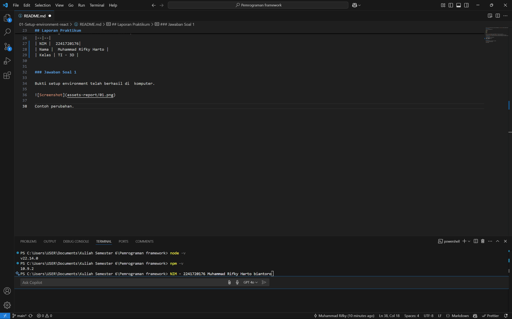

This is a [Next.js](https://nextjs.org/) project bootstrapped with [`create-next-app`](https://github.com/vercel/next.js/tree/canary/packages/create-next-app).

## Getting Started

First, run the development server:

```bash
npm run dev
# or
yarn dev
# or
pnpm dev
# or
bun dev
```

Open [http://localhost:3000](http://localhost:3000) with your browser to see the result.

You can start editing the page by modifying `app/page.tsx`. The page auto-updates as you edit the file.

This project uses [`next/font`](https://nextjs.org/docs/basic-features/font-optimization) to automatically optimize and load Inter, a custom Google Font.

## Laporan Praktikum 1

|  | Pemrograman Berbasis Framework 2024 |
|--|--|
| NIM |  2241720176|
| Nama |  Muhammad Rifky Harto |
| Kelas | TI - 3D |


### Jawaban Soal 1

Kegunaan Git dalam proyek adalah untuk mengontrol versi, dimana pastinya pada saat pengerjaan proyek ada perubahan baik secara minor ataupun mayor, sehingga git adalah tool yang digunakan untuk mengontrol hal tersebut.

VSCode adalah software texteditor yang dikembangkan oleh microsoft, software ini cukup familiar dikarenakan penggunaannya yang cukup mudah, sehingga dapat digunakan oleh programmer dari yang pemula bahkan expert.

NodeJS adalah runtime environment lintas platform yang bersifat open source untuk Java Script. Hal ini memungkinkan kita menjalankan kode JavaScript tidak hanya terbatas pada lingkungan browser

### Jawaban Soal 2
Bukti setup environment telah berhasil di  komputer.




