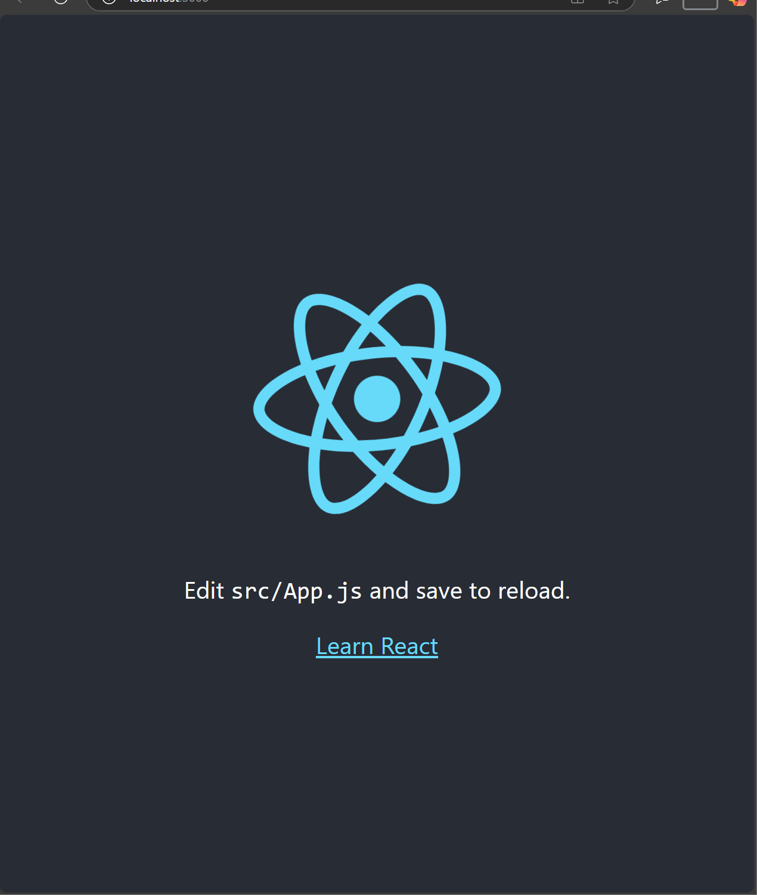
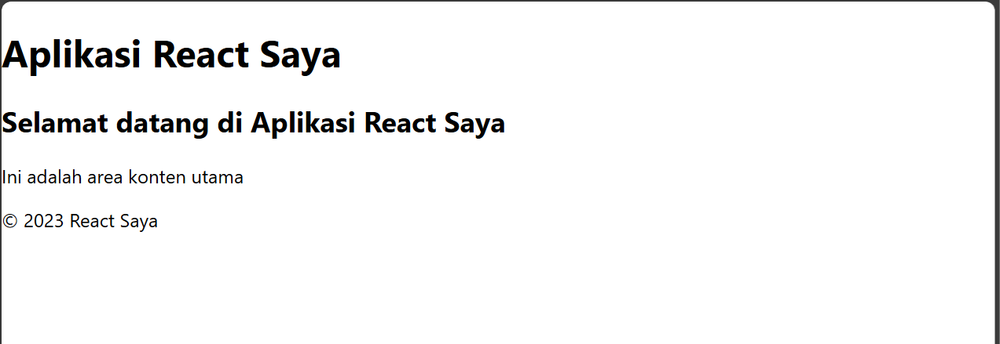
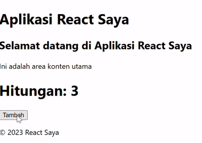
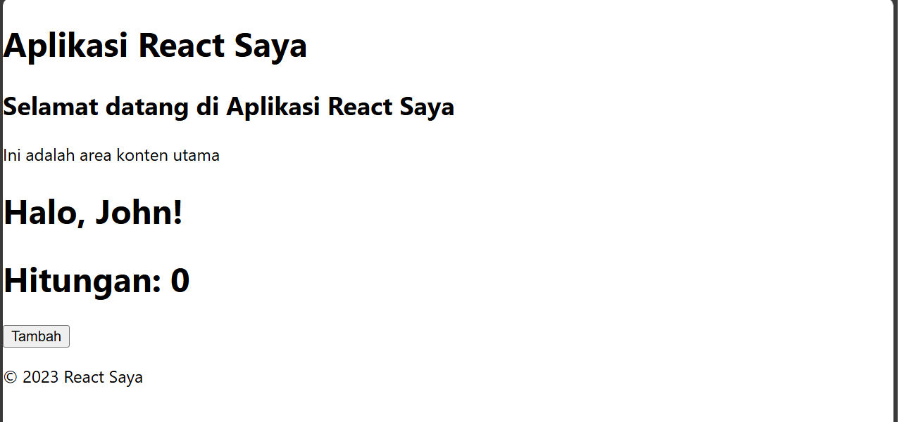
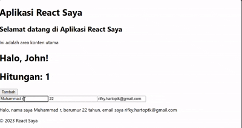
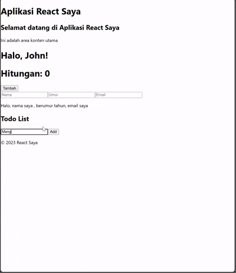

## PRAKTIKUM 1 : Persiapan Environment
1. Pastikan Node.js dan npm sudah terinstal di komputer Anda. Anda dapat memeriksanya dengan 
menjalankan perintah berikut di terminal atau command prompt:
```
node -v
npm -v
```
2. Buat direktori baru untuk proyek React Anda: 
```
mkdir praktikum-react
cd praktikum-react
```
3. Inisialisasi proyek React dengan menjalankan perintah berikut:
```
npx create-react-app my-react-app
cd my-react-app
``` 
4. Jalankan aplikasi React dengan perintah:
```
npm start
```

Hasil eksekusi project bawaan :


## PRAKTIKUM 2 : Membuat Komponen react

1. Buka file src/App.js di text editor Anda. 

2. Ganti kode di dalamnya dengan kode berikut untuk membuat komponen sederhana:
```
import React from 'react';

// Header component
function Header() {
  return (
    <header>
      <h1>Aplikasi React Saya</h1>
    </header>
  );
}

// Main component
function Main() {
  return (
    <main>
      <h2>Selamat datang di Aplikasi React Saya</h2>
      <p>Ini adalah area konten utama</p>
    </main>
  );
}

// footer component
function Footer() {
  return (
    <footer>
      <p>&copy; 2023 React Saya</p>
    </footer>
  );
}

// App component using header, main, and footer components
function App() {
  return (
    <div>
      <Header />
        <Main />
      <Footer />
    </div>
  );
}

export default App;

```
3. Simpan file dan lihat perubahan di browser. Anda akan melihat tampilan sederhana dengan 
header, konten utama, dan footer. 

Hasil: 



## PRAKTIKUM 3 : Menggunakan JSX untuk membuat komponen dinamis

1. Buat file baru di direktori src dengan nama Counter.js

2. Tambahkan kode berikut untuk membuat komponen counter yang dinamis:
```
import React from "react";

function Counter() {
    const [count, setCount] = useState(0);

    function handleClick() {
        setCount(count + 1);
    }

  return (
    <div>
      <h1>Hitungan: {count}</h1>
      <button onClick={handleClick}>Tambah</button>
    </div>
  );
}

export default Counter;
```

3. Buka file src/App.js dan impor komponen Counter:
```
import Counter from './Counter';
```

4.  Tambahkan komponen Counter ke dalam komponen App:
```
function App() {
  return (
    <div>
      <Header />
        <Main />
        <Counter />
      <Footer />
    </div>
  );
}
```

5. Simpan file dan lihat perubahan di browser. Anda akan melihat tombol "Tambah" yang dapat 
meningkatkan hitungan saat diklik.

Hasil :


## PRAKTIKUM 4 : Menggunakan Props untuk Mengirim Data

1. Buat file baru di direktori src dengan nama Greeting.js
2. Tambahkan kode berikut untuk membuat komponen Greeting yang menerima props:
```
function Greeting(props) {
  return <h1>Halo, {props.name}!</h1>
}

export default Greeting;
```

3. Buka file src/App.js dan impor komponen Greeting:
```
import Greeting from'./Greeting';
```

4. Tambahkan komponen Greeting ke dalam komponen App dan kirim props name:
```

```
5. Simpan file dan lihat perubahan di browser. Anda akan melihat pesan "Halo, John!" yang 
ditampilkan oleh komponen Greeting.


## PRAKTIKUM 5 : Menggunakan State untuk Mengolah Data

1. Buka file src/App.js dan tambahkan kode berikut untuk membuat komponen yang mengelola 
state: 
```
function Example() {
  const [name, setName]= useState('');
  const [age, setAge]= useState('');
  const [email, setEmail]=useState('');

  const handleNameChange = (e) => 
    { setName(e.target.value); 

    }

  const handleAgeChange = (e) =>
    { setAge(e.target.value); 

    }
  
  const handleEmailChange = (e) =>
    { setEmail(e.target.value); 

    }
  return (
    <div>
      <input type="text" value={name} onChange={handleNameChange} placeholder="Nama"/>
      <input type="text" value={age} onChange={handleAgeChange} placeholder="Umur"/>
      <input type="text" value={email} onChange={handleEmailChange} placeholder="Email"/>
      <p>Halo, nama saya {name}, berumur {age} tahun, email saya {email}</p>
    </div>
  );
}
```

2. Tambahkan komponen Example ke dalam komponen App:
```
// App component using header, main, and footer components
function App() {
  return (
    <div>
      <Header />
        <Main />
        <Greeting name="John" />
        <Counter />
        <Example/>
      <Footer />
    </div>
  );
}
```

3. Simpan file dan lihat perubahan di browser. Anda akan melihat form input yang dapat 
mengupdate state dan menampilkan data yang dimasukkan. 


## TUGAS 
1. Buat komponen baru bernama TodoList yang menampilkan daftar tugas (todo list). Gunakan state 
untuk mengelola daftar tugas dan props untuk mengirim data tugas ke komponen anak. 
2. Tambahkan fitur untuk menambahkan tugas baru ke dalam daftar menggunakan form input. 
3. Implementasikan fitur untuk menghapus tugas dari daftar. 

Hasil :

