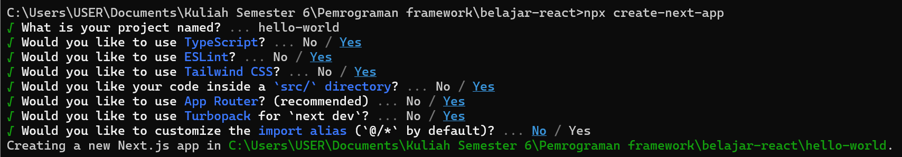
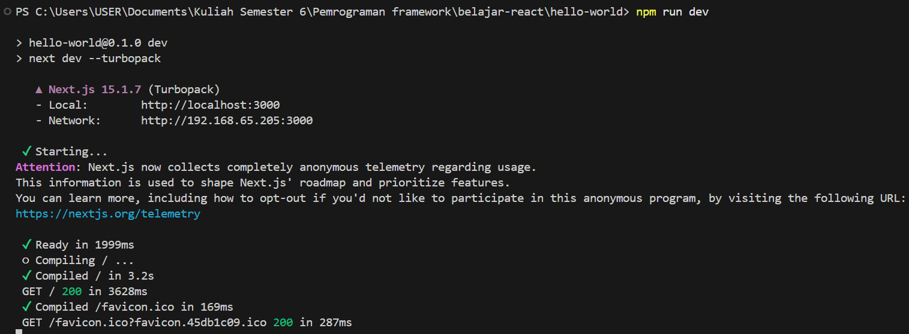
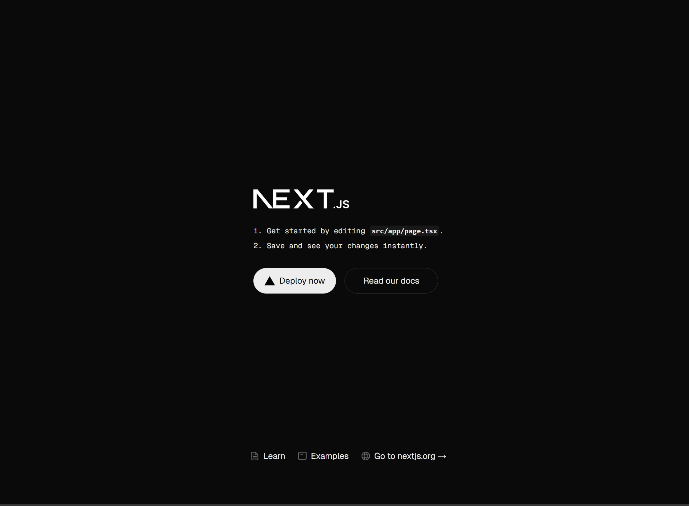
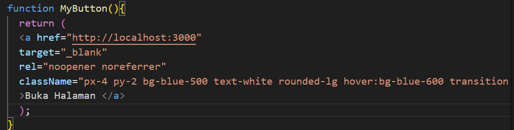
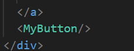
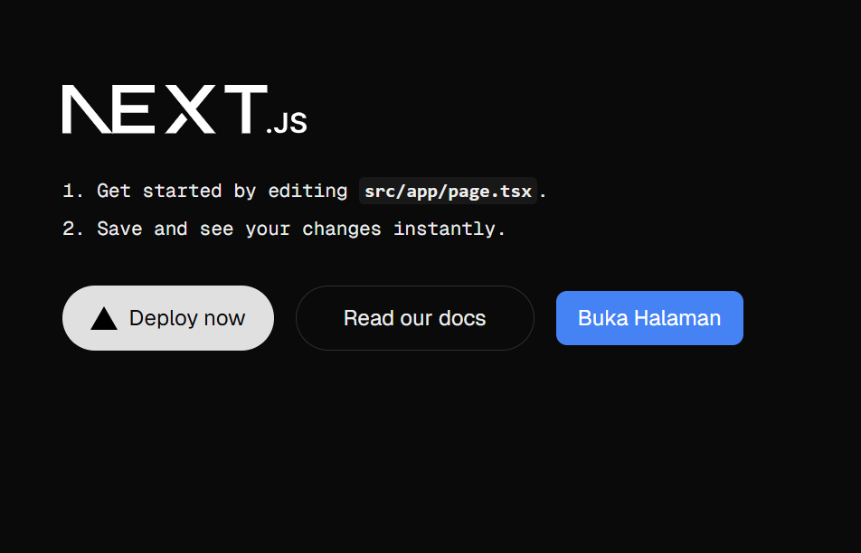
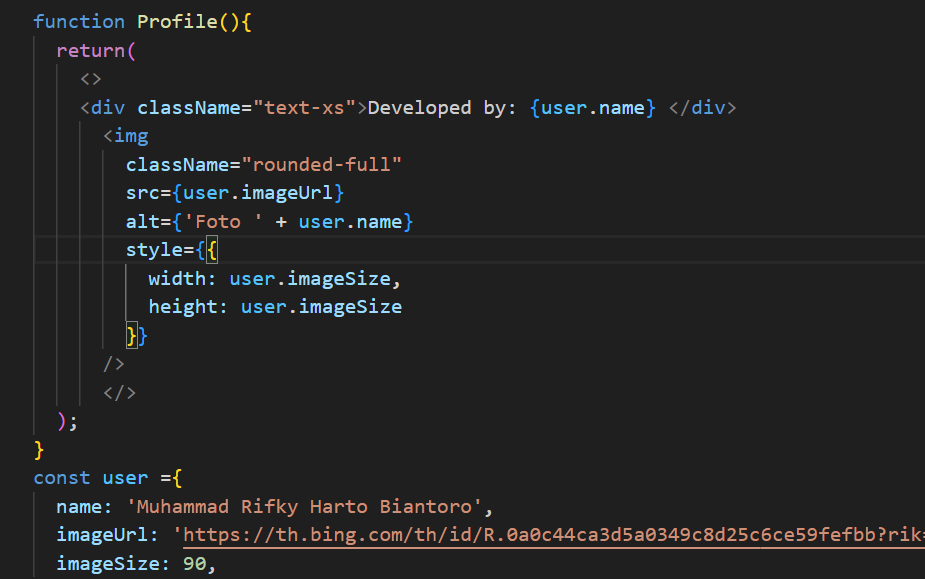
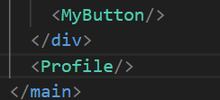
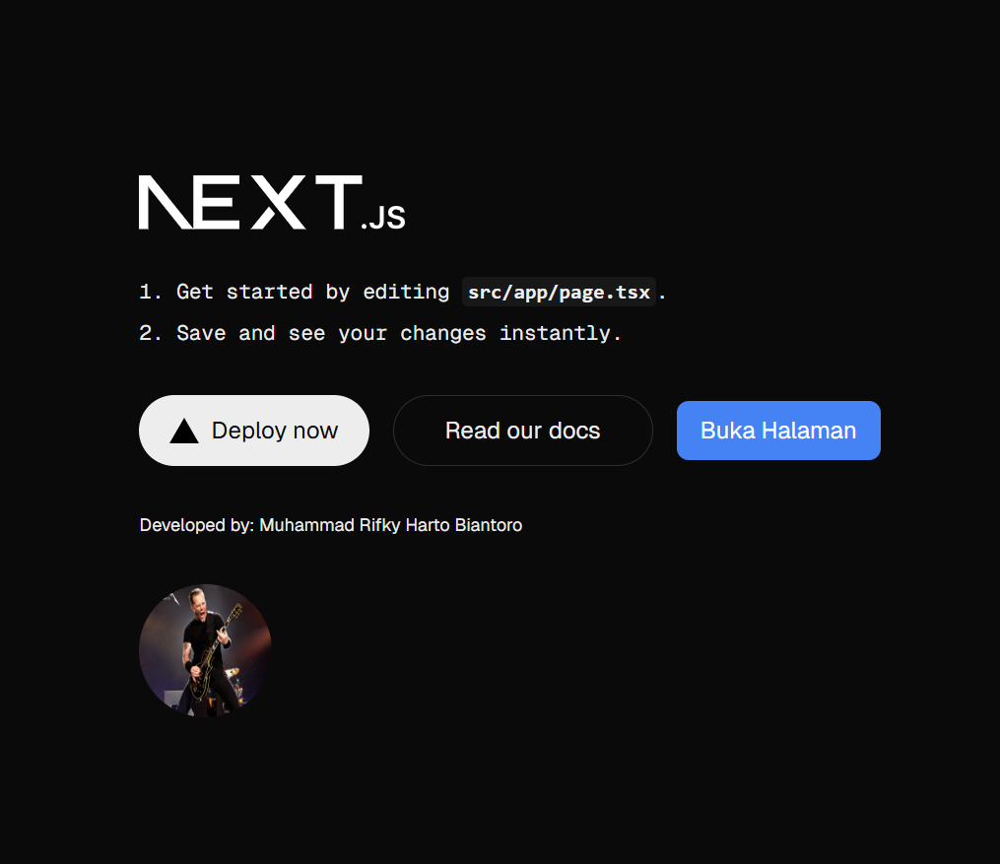

This is a [Next.js](https://nextjs.org) project bootstrapped with [`create-next-app`](https://nextjs.org/docs/app/api-reference/cli/create-next-app).

## Getting Started

First, run the development server:

```bash
npm run dev
# or
yarn dev
# or
pnpm dev
# or
bun dev
```

Open [http://localhost:3000](http://localhost:3000) with your browser to see the result.

You can start editing the page by modifying `app/page.tsx`. The page auto-updates as you edit the file.

This project uses [`next/font`](https://nextjs.org/docs/app/building-your-application/optimizing/fonts) to automatically optimize and load [Geist](https://vercel.com/font), a new font family for Vercel.

## Praktikum 2
Pembuatan proyek menggunakan cli pada CMD/Terminal:



Running proyek npm run dev telah berhasil



Tampilan localhost:



### Pertanyaan praktikum
1. Jelaskan istilah yang muncul pada langkah ke-2 dibawah ini
    a. TypeScript, Bahasa Pemrograman open source yang dikembangkan microsoft. Typescript merupakan superset dari JavaScript dan membantu pengembang untuk mendeteksi kesalahan lebih awal dalam pengembangan aplikasi.
    
    b. ESLint, tool linting untuk JavaScript dan TypeScript. Linting adalah proses menganalisa untuk menemukan masalah potensial atau pelanggaran terhadap pedoman gaya tertentu

    c. TailwindCSS, frameworks css yang memudahkan untuk membangun desain web dengan lebih cepat dan fleksibel.
    
    d. App Router, sistem routing yang digunakan pada aplikasi web(mengelola route url). Menangani mekanisme navigasi antar halaman atau komponen dalam aplikasi.
    
    e. TurboPack, bundler mengoptimalkan pengemasan dan pembangunan aplikasi web.

2.  Apa saja kegunaan folder dan file yang ada pada struktur proyek React yang tampil pada tahap percobaan ke-3!

    Jawab : folder dan file yang terdapat pada struktur proyek pada percobaan tahap ke-3 merupakan bagian-bagian yang akan membentuk hasil, dimana seperti pada folder public yang menyimpan file statis dan akan tampil ketika web di eksekusi. Pada folder node_modules, terdapat depedensi yang digunakan aplikasi Next.js (library,modul). Folder .next digunakan untuk menyimpan hasil build, sementara pada folder src, tempat mengelola rute, halaman dan komponen dalam aplikasi Next.js

## Praktikum 3 : Menambahkan komponen react (button)
Menambahkan fungsi MyButton 


Menambahkan komponen MyButton


Hasil


## Praktikum 4 : Menulis Markup dengan JSX

1. Kegunaan sintaks user.imageUrl adalah untuk memanggil imageUrl yang berada pada const user, lalu ditampilkan pada user.imageUrl.

Menambahkan fungsi profile


menambahkan komponen profile


Hasil
