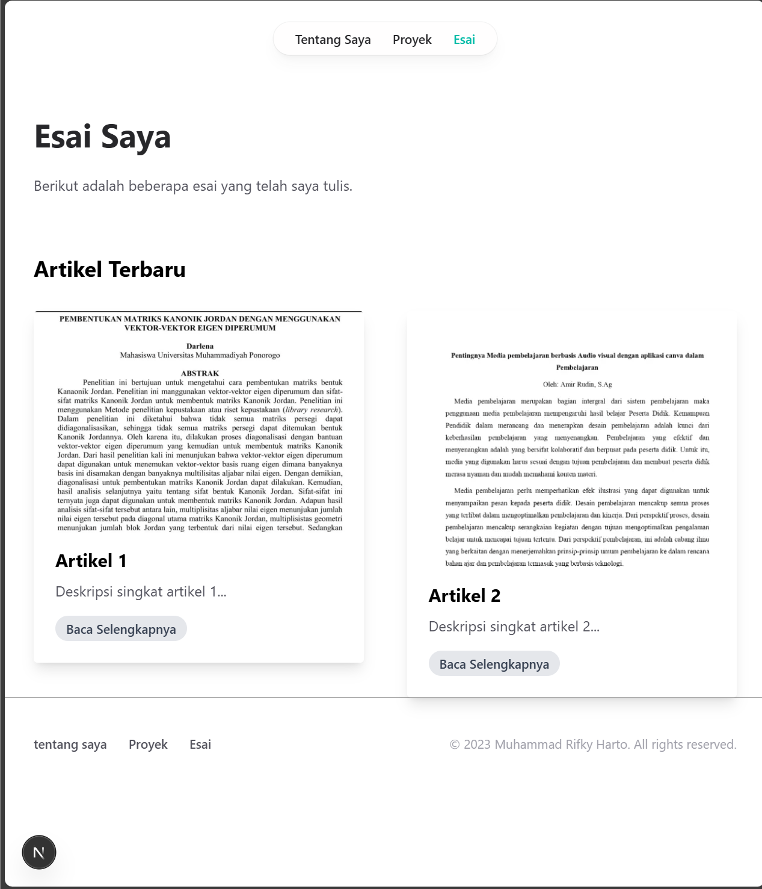
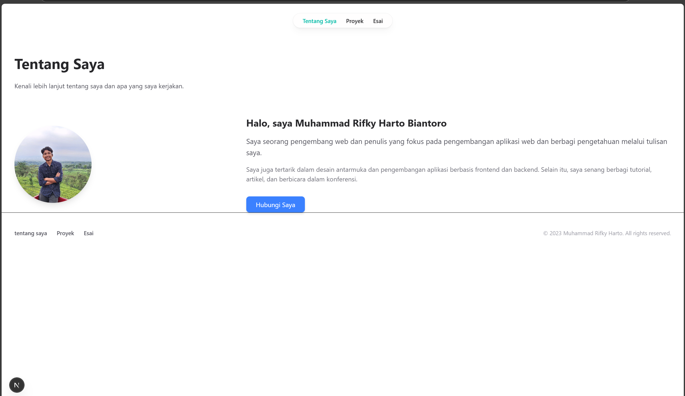
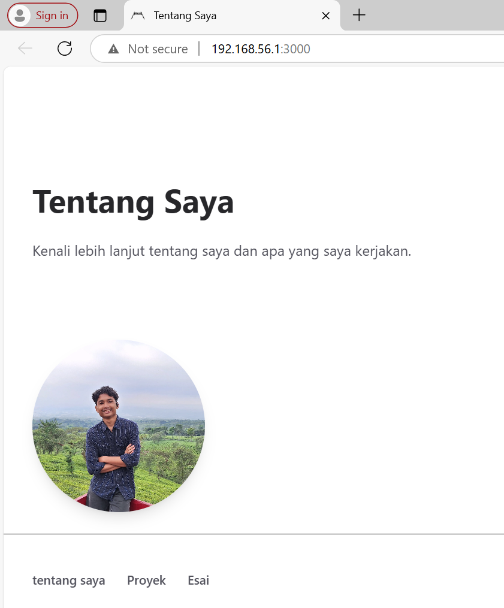

### TUGAS
Eksplorasi Tailwindcss, kemudian. 
1. Modifikasi halaman "Esai" dengan Grid daftar artikel yang telah ditulis. 
2. Modifikasi halaman “Tentang Saya” Buat tampilan yang menarik  

JAWAB :




## Jobsheet 7 Framework
### 6.2. Menambahkan Favicon 
Favicon adalah ikon kecil yang muncul di tab browser dan bookmark. Favicon membantu meningkatkan 
identitas brand website Anda. 
Langkah-langkah: 
1. Siapkan file favicon (format .ico) dan letakkan di folder public/. 
2. Hapus faveicon.ico yang ada di folder src/app 
3. Update file src/components/layout.tsx untuk menambahkan favicon:
```
import Head from 'next/head';
import Navbar from './Navbar';
import Footer from './Footer';

type LayoutProps = {
    children: React.ReactNode;
};

export default function Layout({ children }: LayoutProps) {
    return (
        <>
            <Head>
                <link rel="icon" href="/favicon.ico" />
            </Head>
            <Navbar />
            <main>{children}</main>
            <Footer />
        </>
    );
}
```

4. Simpan dan jalankan proyek. Favicon akan muncul di tab browser.



### 6.3. Menambahkan Metadata untuk SEO 
Metadata seperti title dan description sangat penting untuk SEO. Metadata ini akan muncul di hasil 
pencarian dan membantu mesin pencari memahami konten halaman. 
Langkah-langkah: 
1. Buat file src/utils/metadata.ts untuk menyimpan metadata default:
```
 export const defaultMetadata = {
    title: 'Personal site',
    description :'Personal site of Muhammad Rifky Harto Biantoro',
    openGraph: {
        images: "https://example.com/default-image.jpg",
        url: "https://example.com",
    },
};
```
2. Update file src/components/layout.tsx untuk menggunakan metadata default jika tidak ada metadata yang di-pass:
```
import Head from 'next/head';
import Navbar from './Navbar';
import Footer from './Footer';
import { defaultMetadata } from '@/utils/metadata';

type LayoutProps = {
    children: React.ReactNode;
};

export default function Layout({ children }: any) {
    const metadata =  children.props.metadata || defaultMetadata;
    return (
        <>
            <Head>
                <title>{metadata.title}</title>
                <meta name="description" content={metadata.description} />
                <meta property="og:title" content={metadata.title} />
                <meta property="og:description" content={metadata.description} />
                <meta property="og:image" content={metadata.openGraph.images} />
                <meta property="og:url" content={metadata.openGraph.url} />
                <link rel="icon" href="/favicon.ico" />
            </Head>
            <Navbar />
            <main>{children}</main>
            <Footer />
        </>
    );
}
```

3. Update Setiap Halaman untuk dapat mem-pass definisi metadata 
Contoh Halaman “Tentang Saya” 
```
import type { Metadata } from 'next';
import Image from 'next/image';
import profileImage from '../../public/images/pofile.jpg';

export const metadata: Metadata = {
  title: 'Tentang Saya',
  description: 'Personal site of Muhammad Rifky Harto Biantoro',
  openGraph: {
    images: 'https://example.com/default-image.jpg',
    url: 'https://example.com',
  },
};

export default function Home({ metadata }: any) {
  return  (
    <div className='mt-16 px-8'>
      <header>
        <h1 className='font-bold text-4xl text-zinc-800'>Tentang saya</h1>
      </header>
    </div>
  )
};
```
4. Lanjutkan untuk halaman Proyek dan Esai

### 6.4. Open Graph Tags untuk Media Sosial 
Open Graph Tags digunakan untuk mengontrol bagaimana konten Anda ditampilkan saat dibagikan di 
media sosial seperti Facebook dan Twitter. 
Langkah-langkah: 
1. Pastikan Anda telah menambahkan Open Graph Tags di layout.tsx seperti yang telah dijelaskan 
sebelumnya. 
2. Update metadata di setiap halaman untuk menyertakan Open Graph Tags. 

### 6.5. Menguji SEO 
Setelah menambahkan metadata, favicon, dan Open Graph Tags, Anda dapat menguji SEO dengan 
Membuka halaman di browser dan memeriksa elemen HTML menggunakan Developer Tools (Ctrl + Shift 
+ I atau F12). 


