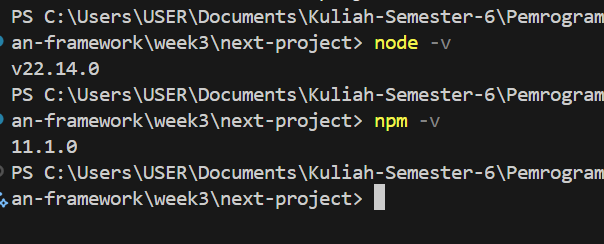
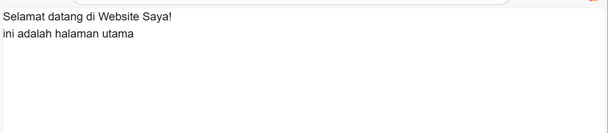

## Langkah praktikum
### Persiapan lingkungan
1. Pastikan Node.js dan npm sudah terinstal di komputer Anda. Anda dapat memeriksanya dengan 
menjalankan perintah berikut di terminal atau command prompt: 

2. Buat direktori baru untuk proyek Next.js Anda 
3. Inisialisasi proyek Next.js dengan menjalankan perintah berikut: Perhatikan bahwa App Router 
belum digunakan

4. Jalankan aplikasi Next.js dengan perintah:


### Membuat halaman dengan Server-Side Rendering
1. Buka file pages/index.tsx di text editor Anda
2. Ganti kode didalamnya dengan kode berikut untuk membuat halaman sederhana:
```
import React from "react";

const HomePage = () => {
  return(
    <div>
      <h1>Selamat datang di Website Saya!</h1>
      <p>ini adalah halaman utama</p>
    </div>
  );
};

export default HomePage;
```
Hasil:


### Membuat halaman dengan static Site Generation (SSG)
1. Buat file baru di direktori pages dengan nama blog.js. 
2. Tambahkan kode berikut untuk membuat halaman blog dengan SSG:
```
import react from 'react';

const Blog = () => {
    return (
        <div>
            <h1>Blog Saya</h1>
            {posts.map((post) => (
                <div key={post.id}>
                    <h2>{post.title}</h2>
                    <p>{post.body}</p>
                </div>
            ))}
        </div>
    );
};

export async function getStaticProps() {
    const res = await fetch('https://jsonplaceholder.typicode.com/posts');
    const posts = await res.json();

    return {
        props: {
            posts,
        },
    };
}

export default Blog;    
```


### Menggunakan Dynamic Routes
1. Buat direktori baru di pages dengan nama blog. 
2. Buat file di dalam direktori blog dengan nama [slug].js 
3. Tambahkan kode berikut untuk membuat halaman dinamis berdasarkan slug:
```
import {useRouter} from 'next/router';

const BlogPost = () => {
  const router = useRouter();
  const {slug} = router.query;

  return (
    <div>
      <h1>Blog Post: {slug}</h1>
      <p>Ini adalah blog post dengan slug {slug}.</p>
    </div>
  );
}

export default BlogPost;
```   


### Menggunakan API Routes 
1. Pastikan terdapat direktori di pages dengan nama api. 
2. Buat file di dalam direktori api dengan nama products.js. 
3. Tambahkan kode berikut untuk membuat API route yang mengembalikan daftar produk: 
```
export default async function handler(req, res) {
    const response = await fetch('https://jsonplaceholder.typicode.com/products');
    const products = await response.json();

    res.status(200).json(products);
}
```
4. Buat file baru di pages dengan nama products.js untuk menampilkan daftar produk:
```
import { useState, useEffect } from "react";

const ProductList = () => {
    const [products, setProducts] = useState([]);

    useEffect(() => {
        const fetchProducts = async () => {
            const response = await fetch('/api/products');
            const products = await response.json();
            setProducts(products);
        };

        fetchProducts();
    }, []);

    return (
        <div>
            <h1>Daftar Produk</h1>
            <ul>
                {products.map((product) => (
                    <li key={product.id}>{product.title}</li>
                ))}
            </ul>
        </div>
    );
};

export default ProductList;
```

Hasil :


### Menggunakan link Component
1. Buka file pages/index.tsx dan tambahkan modif dengan kode berikut untuk membuat link ke halaman lain:
```
import Link from "next/link";

const HomePage = () => {
  return(
    <div>
      <h1>Selamat datang di Website Saya!</h1>
      <p>ini adalah halaman utama</p>
      <link href="/about">
      Tentang Kami
      </link>
    </div>
  );
};

export default HomePage;
```

2. Buat file baru di pages dengan nama about.js untuk halaman "Tentang Kami":
```
const AboutPage = () => {
  return (
    <div>
      <h1>Tentang Kami</h1>
      <p>Kami adalah perusahaan yang mengkhususkan diri dalam pembuatan website berkualitas tinggi</p>
    </div>
  );
}

export default AboutPage;
```
3. Simpan file dan buka http://localhost:3000 di browser. Klik link "Tentang Kami" untuk navigasi ke halaman tentang.

Hasil: 


### TUGAS
1. Buat halaman baru dengan menggunakan Static Site Generation (SSG) yang menampilkan daftar pengguna dari API https://jsonplaceholder.typicode.com/users. 

code :
```
import React from 'react';

export async function getStaticProps() {
  const res = await fetch('https://jsonplaceholder.typicode.com/users');
  const users = await res.json();

  return {
    props: {
      users,
    },
  };
}

const Users = ({ users }) => {
  return (
    <div>
      <h1>Daftar Pengguna</h1>
      <ul>
        {users.map((user) => (
          <li key={user.id}>{user.name}</li>
        ))}
      </ul>
    </div>
  );
};

export default Users;

```

Hasil:


2. Implementasikan Dynamic Routes untuk menampilkan detail pengguna berdasarkan ID.
Code (menambahkan file [id].js pada direkrori pages/users):
```
import React from "react";
import {useRouter} from "next/router";

export async function getStaticPaths() {
    const res = await fetch('https://jsonplaceholder.typicode.com/users');
    const users = await res.json();

    const paths = users.map((user) => ({
        params: {id: user.id.toString()},
    }));

    return {paths, fallback: false};
}

export async function getStaticProps({params}) {
    const res = await fetch(`https://jsonplaceholder.typicode.com/users/${params.id}`);
    const user = await res.json();

    return {
        props: {
            user
        },
    };
}

const UserDetail = ({user}) => {
    const router = useRouter();
    const {id} = router.query;
    return (
        <div>
            <h1>Detail Pengguna {user.name}</h1>
            <p>Email:{user.email}</p>
            <p>Phone: {user.phone}</p>
            <p>Website: {user.website}</p>
        </div>
    );
};

export default UserDetail;
```

Hasil :


3. Buat API route yang mengembalikan data cuaca dari API eksternal (misalnya, 
OpenWeatherMap) dan tampilkan data tersebut di halaman front-end. 

file pages/weather.js untuk menampilkannya:
```
import { useEffect, useState } from 'react';

const fetchWeather = async (city) => {
  const apiKey = '802cecab84c2c09324d9df81d94094de';
  const apiUrl = `https://api.openweathermap.org/data/2.5/weather?q=${city}&appid=${apiKey}`;

  try {
    const response = await fetch(apiUrl);
    const data = await response.json();
    return { city, data };
  } catch (error) {
    console.error(`Error fetching weather data for ${city}:`, error);
    return { city, error: error.message };
  }
};

const fetchWeatherForCities = async (cities) => {
  const weatherData = [];
  for (const city of cities) {
    const data = await fetchWeather(city);
    weatherData.push(data);
  }
  return weatherData;
};

const WeatherPage = () => {
  const [weatherData, setWeatherData] = useState([]);
  const cities = ['Jakarta', 'New York', 'London', 'Tokyo', 'Sydney'];

  useEffect(() => {
    fetchWeatherForCities(cities).then(setWeatherData);
  }, []);

  return (
    <div id="weather-container">
      {weatherData.map(({ city, data, error }) => (
        <div key={city} className="city-weather">
          {error ? (
            <>
              <h2>{city}</h2>
              <p>Error: {error}</p>
            </>
          ) : (
            <>
              <h2>{city}</h2>
              <p>Temperature: {(data.main.temp - 273.15).toFixed(2)}°C</p>
              <p>Weather: {data.weather[0].description}</p>
            </>
          )}
        </div>
      ))}
    </div>
  );
};

export default WeatherPage;
```

Hasil :
